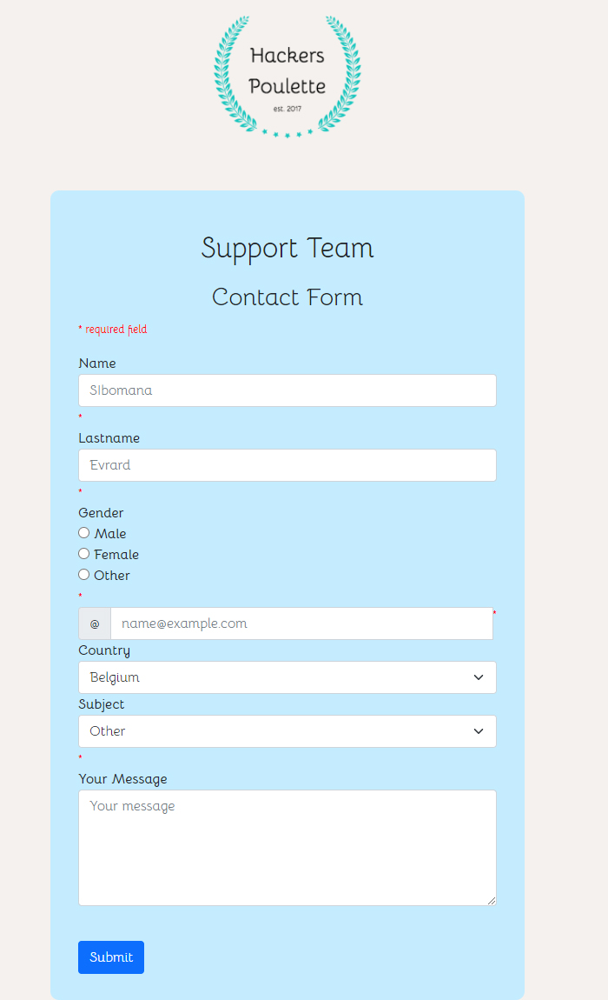

# Hackers-poulette

Realization of a solo project as part of the web dev training at @becodeorg Hackers-poulette

## See the project

You can view the web page via this url [Hackers-poulette](https://hackepoulette.herokuapp.com/)

## Library / Toolkit
* Html
* Css
* Javascrpit
* Php
* Jquery

## Author

* **evrardsibo** _alias_ [@evrardsibo](https://github.com/evrardsibo)

